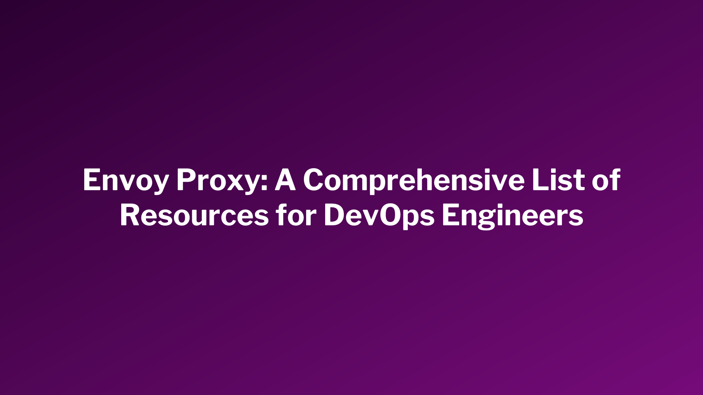

# Knowledge Hub for Envoy Proxy!

> Envoy Proxy is a high-performance, open-source edge and service proxy designed for cloud-native applications, and with its versatile features, it has become an essential component in modern application architectures.
# Introduction
This is a curated knowledge repository of best practices, techniques, tools, tutorials and case studies that can help you learn more about Envoy Proxy.

## Contents
- [Getting Started Guide](#getting-started-guide)
- [Videos](#videos)
- [Course & Certifications](#course-&-certifications)
- [EnvoyCon](#envoycon)
- [Tools and Extensions](#tools-and-extensions)
- [Projects Built on Envoy Proxy](#projects-built-on-envoy-proxy)
- [Configuration Generator](#configuration-generator)
- [Case Studies](#case-studies)
- [Contributing](#contributing)

## Getting Started Guide
This section is dedicated to providing articles on how to get started with Envoy, an open-source edge and service proxy. Whether you're a beginner or looking to expand your knowledge, these articles will help you understand the basics and get started with Envoy.

* [Getting started with Envoy Proxy for microservices resilience](https://www.getambassador.io/resources/getting-started-envoyproxy-microservices-resilience).
* [Get started with Envoy Proxy in 5 minutes](https://tetrate.io/blog/get-started-with-envoy-in-5-minutes/).
* [Envoy threading model](https://blog.envoyproxy.io/envoy-threading-model-a8d44b922310).
* [Envoy hot restart](https://blog.envoyproxy.io/envoy-hot-restart-1d16b14555b5).
* [Envoy stats](https://blog.envoyproxy.io/envoy-stats-b65c7f363342).
* [Get Started with Envoy on your Laptop](https://blog.turbinelabs.io/getting-started-with-envoy-on-your-laptop-1b1a7073fd8e).
* [I tried Getting Started with Envoy](https://iceburn.medium.com/i-tried-getting-started-with-envoy-d6680f69bc3).
* [How to use Envoy as a Load Balancer in Kubernetes](https://blog.markvincze.com/how-to-use-envoy-as-a-load-balancer-in-kubernetes/).
* [Architecture overview: Envoy Docs](https://www.envoyproxy.io/docs/envoy/latest/intro/arch_overview/arch_overview).
* [What is Envoy](https://www.envoyproxy.io/docs/envoy/latest/intro/what_is_envoy).
* [Envoy Proxy: Concepts, Architecture & Quick Tutorial](https://www.solo.io/topics/envoy-proxy/).
* [Anatomy of envoy proxy: the architecture of envoy and how it works](https://songrgg.github.io/architecture/deeper-understanding-to-envoy/).
* [Service Mesh with Envoy](https://www.loginradius.com/blog/engineering/service-mesh-with-envoy/).
* [Service mesh data plane vs. control plane](https://blog.envoyproxy.io/service-mesh-data-plane-vs-control-plane-2774e720f7fc).

## Videos
* [Domain Driven Design - Clean Architecture using EnvoyProxy API Gateway](https://youtu.be/CpJykFQ5wo8).
* [Envoy Proxy is Your Gateway to Service Mesh](https://www.youtube.com/live/j8pvQ1ftC24).
* [Deploying Envoy in K8s and Configuring as Load Balancer](https://youtu.be/qqG64yt4H5c).
* [Load balancing and HTTP Routing with Envoy Proxy](https://youtu.be/D0cuv1AEftE).
* [What is Envoy Proxy and What you need it for Microservices](https://youtu.be/Wu2KDFJv66Y).
* [Understanding the Basics of Envoy Configuration](https://youtu.be/E-UpGmj6B9M).
* [Developing Envoy Wasm Extensions](https://www.youtube.com/live/JIq8wujlG9s).
* [Envoy on Fire: A Practical Look at Debugging a Service Mesh](https://youtu.be/6jnzo8QXyDk).
* [Envoy Fundamentals](https://www.youtube.com/live/f0QEHEm9ERc).
* [Build an API Gateway with Envoy and use with .NET Core APIs](https://youtu.be/UsoH5cqE1OA).
* [Hands-on Workshop: Envoy Metrics Demystified Workshop](https://youtu.be/Vlgw3GYUDiM).
* [Cloud-Native Building Blocks: An Interactive Envoy Proxy Workshop](https://youtu.be/SNM-wnyRR8U).
* [Envoy Proxy Crash Course, Architecture, L7 & L4 Proxying, HTTP/2, Enabling TLS 1.2/1.3](https://youtu.be/40gKzHQWgP0).
* [Inside Envoy - The Proxy for the Future](https://www.youtube.com/watch?v=uaksVVHDhYU).
* [Envoy Gateway: An in-Depth Guide of Its Benefits and Use Cases](https://www.youtube.com/watch?v=06ylMQrj0jU).
* [A Practical Guide to Understanding and Configuring Envoy Filters](https://www.youtube.com/watch?v=9tITEHHW-J4).

## Course & Certifications
* [Get Started with Envoy Proxy - Free](https://academy.solo.io/get-started-with-envoy-proxy-with-fundamentals-for-envoy-certification).
* [Learn Envoy Fundamentals - Free](https://academy.tetrate.io/courses/envoy-fundamentals).
* [Learn Istio Fundamentals - Free](https://academy.tetrate.io/courses/istio-fundamentals).
* [Certified Istio Administrator - Premium](https://academy.tetrate.io/courses/certified-istio-administrator).

## EnvoyCon
In this section, you will find a collection of talks that are focused on Envoy. These resources were presented at EnvoyCon, a conference dedicated to all things Envoy.

### 2023
* [Envoy Gateway Project Update](https://youtu.be/peWssHWmCUQ?si=0LvOrsatgvNy6jQS).
* [A Platform-Agnostic Approach to Securing Workloads](https://youtu.be/Z1cfb6nRkd8?si=sFvE7GEoPPaZZCxU).
* [SLATE: Intelligent Request Routing](https://youtu.be/iBQaaGBQVMA?si=tVQXK71Ty_rgSY74).

### 2022
* [Leveraging Envoy to Implement Micro-Segmentation-Based Security Policies](https://youtu.be/EKyV_m--Dk0).
* [Pushing Envoy Beyond the Edge](https://youtu.be/WZW2UTHFDMs).
* [Envoy Gateway Project Update](https://youtu.be/3MUOZc8XNCc).
* [Envoy Upstream Enhancements](https://youtu.be/N0cjEvbe8zQ).
* [Honey, I Broke the Things: Debugging Gray Failures in Production!](https://youtu.be/qD5pSvMem8s).
* [Manipulating HTTP Headers Using a Full Set of Substitution](https://youtu.be/WN1oLAgAfAk).
* [How Lyft Used Envoy to Rethink Microservice Development](https://youtu.be/p9dYr23MVv0).
* [Extending Envoy for Our Use: An End User Adoption Story from Fidelity](https://youtu.be/yWaaCzHMy_c).
* [Access Control and URI Path Normalization](https://youtu.be/534w03uDNwQ).
* [More Intelligent Global Rate Limiting](https://youtu.be/oZBBzkwfmc4).
* [Distributed Tracing Without the Pain!](https://youtu.be/xSoF5XRx8l8).
* [Hardware Accelerated Service Mesh Overview](https://youtu.be/XjT0D5Yz8Fo).

### 2021
* [Using Envoy as an Egress Proxy for TLS Enabled Traffic](https://youtu.be/B8nTc08CeRQ).
* [Lessons Learned: Four Years with Emissary-ingress and Envoy](https://youtu.be/zLIcMyBedTc).
* [Health Checks: A Boon or a Curse?](https://youtu.be/Qf-B2dfCLJU).
* [Dedicated Infrastructure in a Multitenant World](https://youtu.be/nWKu7ThNKwM).
* [HTTP/3 in Envoy: End to End Acceleration](https://youtu.be/_7YxKNVvCGI).
* [Connecting the (Proxy) Dots: A Beginners Guide to Reading Envoy Debug Logs](https://youtu.be/a7j0qCOwlsE).
* [State of Go Control Plane: What Does the Future Behold?](https://youtu.be/vbNhRftJX9o).
* [Extending Envoy Using WebAssembly (Wasm)](https://youtu.be/JFPJdNrcHSA).
* [The Trials and Success of Adopting Envoy at Tinder](https://youtu.be/oGTiqFxsxUs).
* [Speeding up Istio: Our Journey Implementing Delta xDS](https://youtu.be/LOm1ptEWx_Y).
* [Load Shedding for Evil Wizards](https://youtu.be/UInZ9yViUS0).

### 2020
* [PostgreSQL Network Filter for EnvoyProxy](https://youtu.be/CbNc9HggyRA).
* [Hands-on WASM filters and singletons](https://youtu.be/BZsyqYiD520).
* [CacheFilter: Flexible HTTP Caching in Envoy](https://youtu.be/uIgYxp-SbBw).
* [xDS transport and versioning evolution](https://youtu.be/Mgveowb8dkI).
* [Envoy on Windows: Use-cases, roadmap, and more](https://youtu.be/f3DezuydHr4).
* [xds-relay: Performance initiatives for control plane management](https://youtu.be/sdKklehKW78).
* [Authorization with Envoy at Square](https://youtu.be/-40Dr7tpalU).
* [Improving performance of RPCs with envoy at Wikimedia](https://youtu.be/uuYkOK3qyxA).
* [Safely deploying a 100K line Envoy YAML configuration to production](https://youtu.be/80I1SzsTmLg).
* [Using Wasm to develop Envoy Filters for supporting Yahoo Headers](https://youtu.be/CsrDtutkNcM).
* [Failing forward to 1 million requests per second](https://youtu.be/2EU7kFxl6RI).
* [How Niantic switched Pokémon GO to use Envoy](https://youtu.be/dUck3tBrfYQ).
* [Changing Oil for a Fast Running (Side) Car Quickly and Safely](https://youtu.be/YBnR09EEYMU).
* [xDS Support in gRPC](https://youtu.be/IbcJ8kNmsrE).
* [Incrementally Building Incremental](https://youtu.be/nFEP2QReOQM).
* [Creating request buffering filters for edge devices](https://youtu.be/Aur3cNIui_U).
* [Support Arm64 platform in Envoy](https://youtu.be/w8XIT5j-s14).

### 2019
* [Dynamic Request Routing With Envoy](https://youtu.be/5wyzlCCBRxg).
* [Building Low Latency Topologies with Envoy](https://youtu.be/8fOSfvV17zY).
* [Overview of Authentication and Authorization Features in Envoy](https://youtu.be/YgoQ4SwRtBA).
* [Graph-based ML Anomaly Detection and Insights for Envoy Systems](https://youtu.be/zBoE8FbJbGI).
* [Solving Microservice Murder Mysteries with Envoy's Tap Filter](https://youtu.be/qJHZVEAu6-A).
* [Making Envoy Sustainable](https://youtu.be/Eh2bV9KZlXM).
* [Envoy Mobile in Depth: From Server to Multi-platform Library](https://youtu.be/3ghO2K1Pd2k).
* [Envoy’s Using 10GB of Memory and It’s All My Fault!](https://youtu.be/rdJZk6k314k).
* [Envoy Namespaces - Operating an Envoy-based Service Mesh at a Fraction of the Cost](https://youtu.be/08opgZkdYIw).
* [Spanning the Globe with Envoy at Stripe](https://youtu.be/QYCsd4Ptwzo).
* [Service Mesh in Kubernetes: It’s Not That Easy](https://youtu.be/BTuDY2naDJI).
* [Evolution of Envoy as a Dynamic Redis Proxy](https://youtu.be/SWVGENzonHE).
* [Managing Tens of Thousands of Envoy: How We Do It](https://youtu.be/eXv_4w2_Ohc).

### 2018
* [Building + operating a service mesh at a mid-size company](https://youtu.be/l81Po028Ocw).
* [Using Envoy for data aware traffic routing in Azure Service Fabric](https://youtu.be/V33ZN7SH9m4).
* [Integrating Envoy with DPDK-based virtual networks](https://youtu.be/sZhlze6NBWU).
* [Hardening Envoy](https://youtu.be/VRgErpsIN9I).
* [Debugging microservices applications with Envoy + Squash](https://youtu.be/i5_eacXkw3w).
* [Extending Envoy with Go](https://youtu.be/5x_SsEg6zu4).
* [How to DDOS yourself with Envoy (and other tales of migration horror)](https://youtu.be/_ysERgu14MA).
* [Use Envoy + Knative to auto scale Java RPC micro service](https://youtu.be/pdcdv3bfSmQ).
* [Bridging the gap between on-prem and cloud](https://youtu.be/ICNRK9a7Cwg).

## Configuration Generator
You may need an Envoy configuration generator to simplify the process of configuring and deploying Envoy proxies in your infrastructure. An Envoy configuration generator can help automate this process by providing a user-friendly interface for defining your proxy's behavior, and then generating the corresponding configuration file automatically.
* [Front proxy template](https://github.com/envoyproxy/envoy/blob/9f65b998949f89170decb393dbaa591924820df9/configs/envoy_front_proxy.template.yaml).
* [Double proxy template](https://github.com/envoyproxy/envoy/blob/9f65b998949f89170decb393dbaa591924820df9/configs/envoy_double_proxy.template.yaml).
* [Service to service template](https://github.com/envoyproxy/envoy/blob/9f65b998949f89170decb393dbaa591924820df9/configs/envoy_service_to_service.template.yaml).
* [Generator script](https://github.com/envoyproxy/envoy/blob/9f65b998949f89170decb393dbaa591924820df9/configs/configgen.py).

## Tools and Extensions
Supercharge your Envoy setup with these top-notch tools, extensions and example configurations
* [K8s-native AuthN/AuthZ service to protect your APIs](https://github.com/Kuadrant/authorino).
* [Custom envoy extensions](https://github.com/envoyproxy/envoy/tree/main/source/extensions).
* [Limitador: rate limiter](https://github.com/Kuadrant/limitador).
* [A plugin to enforce OPA policies with Envoy](https://github.com/open-policy-agent/opa-envoy-plugin).
* [Easy auth for reverse proxies](https://github.com/travisghansen/external-auth-server).
* [Starter Envoy configurations for various use cases](https://github.com/envoyproxy/envoy/tree/main/examples).
* [Example of consuming Envoy and adding a custom filter](https://github.com/envoyproxy/envoy-filter-example).
* [Envoy Proxy Big Book of Examples](https://github.com/repenno/envoybigbook).
* [Envoy filters in Go](https://github.com/myteksi/ego-demo).
* [Istio/Envoy RBAC & ABAC authorization middleware based on Casbin](https://github.com/casbin/envoy-authz).
* [Ansible Role for Envoy Proxy](https://github.com/hugoprudente/ansible-role-envoyproxy).
* [Envoy config linter](https://envoylint.com/).
* [Teaching myself about Envoy on Kubernetes](https://github.com/bakins/kubernetes-envoy-example).
* [Envoy config linter](https://envoylint.com/).

## Projects Built on Envoy Proxy
### Open Source Projects
* [Ambassador: an open source K8s-native API Gateway built on Envoy](https://github.com/emissary-ingress/emissary).
* [Cilium : secure network connectivity between application workloads](https://github.com/cilium/cilium).
* [Cloud Foundry: abstracts away infrastructure so you can focus on app innovation](https://github.com/cloudfoundry).
* [Consul Connect service mesh: offers first-class support for using Envoy as a proxy](https://github.com/hashicorp/consul).
* [Contour: an Ingress controller for Kubernetes](https://github.com/projectcontour/contour).
* [Enroute Universal Gateway: an Open-Source Envoy powered Cloud-Native API Gateway](https://github.com/saarasio/enroute).
* [Gimbal: a layer 7 load balancing platform built on Kubernetes](https://github.com/projectcontour/gimbal).
* [Func-e: allows you to quickly see available versions of Envoy and try them out](https://github.com/tetratelabs/func-e).
* [Gloo Edge: an open-source function gateway built on top of the Envoy Proxy](https://github.com/solo-io/gloo).
* [Istio: provides a uniform way to connect, manage, and secure microservices](https://github.com/istio).
* [Kuma: an open-source control plane for Service Mesh and Microservices](https://github.com/kumahq/kuma).
* [Gloo Mesh: delivers connectivity, security, observability, and reliability for workloads](https://github.com/solo-io/gloo-mesh).

### Commercial Offerings
* [App Mesh: uses Envoy as its service proxy](https://aws.amazon.com/app-mesh/).
* [Grey Matter: a cloud-native, cloud agnostic intelligent service mesh](https://www.greymatter.io/).
* [Instana: is the Application Performance Management solution](https://www.instana.com/).
* [Octarine: delivers total visibility, easy policy management, and strong app security](https://www.vmware.com/security.html).
* [Solo.io: develops tools to help the enterprise adopt innovative cloud technologies](https://www.solo.io/).
* [Tetrate: manage the complexity of modern, hybrid cloud application infrastructure](https://tetrate.io/).
* [Datawire's toolkit: empowers developers to adopt a cloud-native development workflow for K8s services.](https://www.getambassador.io/?utm_source=https://www.datawire.io/).

## Case Studies
In this section, readers will find case studies that showcase how various organizations have implemented Envoy in their operations. These case studies provide insights into the practical applications and benefits of using Envoy in different contexts.
* [Dropbox: How we migrated Dropbox from Nginx to Envoy](https://dropbox.tech/infrastructure/how-we-migrated-dropbox-from-nginx-to-envoy).
* [Mux: Envoy as a service-to-service proxy](https://www.mux.com/blog/envoy-as-a-service-to-service-proxy).
* [Monzo: We deployed Envoy Proxy to make Monzo faster](https://monzo.com/blog/2019/04/03/deploying-envoy-proxy).
* [Turbine Labs: Our Move to Envoy](https://blog.turbinelabs.io/our-move-to-envoy-bfeb08aa822d).
* [Slack: Migrating Millions of Concurrent Websockets to Envoy](https://slack.engineering/migrating-millions-of-concurrent-websockets-to-envoy/).

* [Geckoboard: We rolled out Envoy at Geckoboard](https://medium.com/geckoboard-under-the-hood/we-rolled-out-envoy-at-geckoboard-13c45b4eaddd).
* [Palantir: Using Envoy for Egress Traffic](https://blog.palantir.com/using-envoy-for-egress-traffic-8524d10b5ee2).
* [Snapchat: From Monolith to Multicloud Micro-Services: Inside Snap’s Service Mesh](https://eng.snap.com/monolith-to-multicloud-microservices-snap-service-mesh).
* [Spotify: How Spotify Migrated Ingress HTTP Systems to Envoy](https://youtu.be/HfRU414cjjQ).
* [Tinder: How Tinder implemented Envoy global rate limiting at scaleVirtual](https://youtu.be/2EKU8zCQAow).
* [Pinterest: Running Envoy at the Edge](https://youtu.be/4x5WjxAMvKY).
* [Ebay: Running Envoy at the Edge](https://youtu.be/a1tXFUrqt5M).
* [Square: Envoy at Square](https://youtu.be/7uU6tYt3v0c).

## Contributing
Please take a look at the [contribution guidelines](CONTRIBUTING.md) first. Contributions are always welcome!
If you have any question about this opinionated list, do not hesitate to contact me [@cpuram1](https://twitter.com/cpuram1) on Twitter or open an issue on GitHub.

